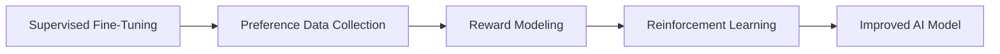

# Human Feedback and Reinforcement Learning from Human Feedback (RLHD)

## Introduction to Human Feedback

Human feedback is, in simple terms, the information, corrections, or evaluations provided by humans about the outputs generated by an AI system. It plays a fundamental role in modern AI systems. It helps models produce responses that are more accurate, useful, safe, and aligned with human expectations. By incorporating human judgments, AI developers can improve model behavior and better adapt systems to real-world needs.

## Why Human Feedback Matters

Human feedback is essential in modern AI systems. Although computers are excellent at processing large amounts of data, they do not truly understand context, empathy, or common sense. Human judgments help align AI behavior with human expectations and improve the overall quality of model outputs.

Human feedback is important because it:

- Improves the quality and usefulness of responses.
- Helps AI systems align with human values and expectations.
- Reduces harmful, misleading, or inaccurate outputs.
- Enables models to better handle real-world scenarios.
- Supports the development of safer and more reliable AI systems.

## Characteristics of High-Quality Human Feedback

Not all feedback is equally valuable. High-quality human feedback is essential for improving AI systems and ensuring that model outputs align with human expectations. Effective feedback should be consistent, accurate, and focused on relevant aspects of the task.

- **Consistency:** Feedback should apply the same standards accors similar tasks and responses. Consistent evaluationshel reliable model training.
- **Accuaracy:** Feedback should correctly reflectthe quality of the output. Inaccurate evaluationscanlead to poor model behavior.
- **Objectivity:** Evaluators should minimize personal preferences and focus on the established guidelines and quality criteria.
- **Clarity:** Feedback should be especific and easy to understand. Clear explanations make it easier to identify strengths and wealnesses in model outputs.
- **Relevance:** Evaluations should foculs on aspects that are directly related to the user's request and the task requirements.
- **Completeness:** Good feedback considers multiple dimensionsof quality, such as accuracy, helpfulness, clarity and safety.

| Characteristic | Description                                          |
| -------------- | ---------------------------------------------------- |
| Consistency    | Applies the same standards across similar tasks.     |
| Accuracy       | Correctly reflects output quality.                   |
| Objectivity    | Minimizes personal bias.                             |
| Clarity        | Provides understandable and specific evaluations.    |
| Relevance      | Focuses on the user's request and task requirements. |
| Completeness   | Considers multiple quality dimensions.               |

## What is RLHF?

RLHF (Reinforcement Learning from Human Feedback) is a technique used to train AI models using human preferences and evaluations. It helps align model behavior with human expectations, making AI systems more helpful, accurate, and safe.

Instead of relying only on large amounts of training data, RLHF incorporates human judgments to guide the model toward producing higher-quality outputs. Human evaluators compare responses, provide feedback, and help define which behaviors should be rewarded or discouraged.

RLHF has become a fundamental component in the development of modern large language models such as ChatGPT, Claude, and Gemini.

## The RLHF Pipeline

The RLHF process consists of four main stages. Each stage contributes to improving model behavior and aligning outputs with human preferences.

### 1. Supervised Fine-Tuning (SFT)

    The process begins with supervised fine-tuning. Human-generated examples are used to train the model to imitate high-quality responses. This stage provides the foundation for further alignment.

### 2. Preference Data Collection

    Human evaluators compare multiple model responses and indicate which one is better. These preferences provide valuable information about what humans consider helpful, accurate, and appropriate.

### 3. Reward Modeling

    The collected preferences are used to train a reward model. This model learns to predict which responses are preferred by humans and assigns scores to different outputs.

### 4. Reinforcement Learning

    Finally, reinforcement learning techniques are used to optimize the model based on the reward model. The AI system learns to generate responses that receive higher scores and better align with human expectations.

## Benefits of RLHF

RLHF offers several advantages for modern AI systems:

- Improves response quality and usefulness.
- Enhances safety and reliability.
- Aligns model behavior with human values and preferences.
- Reduces harmful or misleading outputs.
- Enables better performance in real-world applications.

## Limitations and Challenges

Despite its advantages, RLHF also presents several limitations and challenges. Human feedback is valuable, but it is not perfect, and the quality of the training process depends heavily on the quality and consistency of human evaluations.

Some common challenges include:

- **Subjectivity:** Different evaluators may have different preferences and interpretations, leading to inconsistent feedback.
- **Bias:** Human feedback can reflect personal, cultural, or societal biases, which may influence model behavior.
- **Scalability:** Collecting and annotating human preferences requires significant time and resources.
- **Evaluation Quality:** Poor or inconsistent evaluations can negatively affect model performance.
- **Reward Hacking:** Models may learn to optimize for reward signals without truly improving their understanding or usefulness.
- **Changing Human Preferences:** Human expectations and values are not fixed and may evolve over time.
- **Complex Tasks:** Some tasks are difficult to evaluate because they require specialized knowledge or subjective judgment.

Understanding these challenges is essential for building AI systems that are reliable, safe, and aligned with human expectations.

## Real-World Applications

Human feedback and RLHF are widely used in modern AI systems to improve performance, safety, and alignment with human preferences. Some common applications include:

### Conversational AI

>Large language models such as ChatGPT, Claude, and Gemini use human feedback to generate responses that are more helpful, accurate, and safe.

### Content Moderation

>AI systems use human annotations and feedback to identify harmful, toxic, or inappropriate content on online platforms.

### Recommendation Systems

>Streaming services and e-commerce platforms use user feedback and preferences to provide more relevant recommendations.

### Search Engines

>Human evaluations help improve search quality by identifying the most relevant and useful results for users.

### Machine Translation

>Human reviewers provide corrections and evaluations that help translation models produce more natural and accurate outputs.

### Customer Support

>AI-powered assistants use feedback from users and human reviewers to improve response quality and provide better support experiences.

### Autonomous Systems

>Human feedback helps train and evaluate systems used in robotics and autonomous vehicles, contributing to safer and more reliable behavior.

## key Terms and Definitions

| Term                   | Definition                                                                                                                  |
| ---------------------- | --------------------------------------------------------------------------------------------------------------------------- |
| Human Feedback         | Evaluations, corrections, or preferences provided by humans to improve AI systems.                                          |
| RLHF                   | Reinforcement Learning from Human Feedback, a technique that uses human feedback to align AI models with human preferences. |
| SFT                    | Supervised Fine-Tuning, the initial training stage based on human-generated examples.                                       |
| Preference Data        | Comparisons or rankings provided by human evaluators to indicate preferred model outputs.                                   |
| Reward Model           | A model trained to predict which outputs are preferred by humans.                                                           |
| Reinforcement Learning | A machine learning approach that optimizes model behavior using reward signals.                                             |
| Alignment              | The process of making AI systems behave according to human values and expectations.                                         |
| Annotation             | The process of labeling or evaluating data to support model training and assessment.                                        |
| Evaluator              | A person who reviews and assesses AI-generated outputs according to specific guidelines.                                    |
| Bias                   | Systematic errors or preferences that can affect human feedback and model behavior.                                         |
| Hallucination          | The generation of incorrect, misleading, or fabricated information by an AI model.                                          |
| Reward Hacking         | A situation in which a model maximizes reward signals without genuinely improving output quality.                           |
| Continuous Improvement | An iterative process in which feedback and evaluation are used to enhance AI systems over time.                             |
